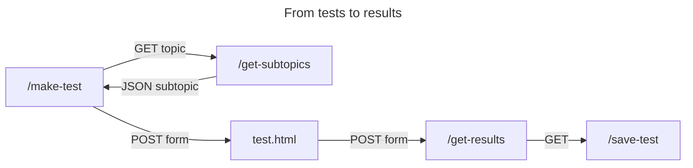

# Documentation

This documentation contains information for troubleshooting and further developement.

## 1. Database

Here's an overview over _Test_**Forge** database.


The databsae design is pretty straightforward, but some tables might need some explanation.

### 1.1. user_questions
In order to keep the database small, the `user_questions` only stores one row of data per user and question. So instead of having multiple entries, the values of `timesDone` and `timesRight` are just updated and incremented each time a user answers a question again.

### 1.2. user_tests
The table `user_tests` stores the tests in form of a comma-seperated string containing the questions `q_ids`. This way only one row is needed to store a test. If called, the string gets split up into a list, which then is fed into the `get_selected_questions(q_ids)` function.

### 1.3. teststats
This table is just a simple counter, which is updated each time, a test is submitted for evaluation. It has just one row of data but if this row is missing, you'll get a server error each time you submit a test or visit `/statistics`

### 1.4. Troubleshooting
If you mess up your database in the docker version, simply delete the `database.db` file from `/app/database` or your mounted volume and restart the container.

For a local flask instance you can create a new sqlite database with these commands:

```sql
-- static tables
CREATE TABLE users (u_id INTEGER PRIMARY KEY NOT NULL DEFAULT rowid, 
    name TEXT NOT NULL, hash TEXT NOT NULL,role TEXT NOT NULL DEFAULT 'user');

CREATE TABLE topics (t_id INTEGER PRIMARY KEY NOT NULL DEFAULT rowid, topic TEXT NOT NULL);

CREATE TABLE subtopics (s_id INTEGER PRIMARY KEY NOT NULL DEFAULT rowid, 
    t_id INTEGER, subtopic TEXT NOT NULL, 
    FOREIGN KEY (t_id) REFERENCES topics(t_id));

CREATE TABLE questions (q_id INTEGER PRIMARY KEY NOT NULL DEFAULT rowid, 
    s_id INTEGER NOT NULL, question TEXT NOT NULL, difficulty INTEGER DEFAULT 0, 
    isMultipleChoice NUMERIC DEFAULT 0, 
    FOREIGN KEY (s_id) REFERENCES subtopics(s_id));

CREATE TABLE answers (a_id INTEGER PRIMARY KEY NOT NULL DEFAULT rowid, q_id INTEGER NOT NULL, 
    answer TEXT NOT NULL, comment TEXT, is_true NUMERIC NOT NULL DEFAULT 0, 
    FOREIGN KEY (q_id) REFERENCES questions(q_id));

CREATE TABLE user_questions (u_id INTEGER NOT NULL, q_id INTEGER NOT NULL, 
    timesDone INTEGER NOT NULL, timesRight INTEGER NOT NULL, 
    accuracy REAL GENERATED ALWAYS AS (ROUND(CAST(timesRight AS REAL) / CAST(timesDone AS REAL),2)),lastDate TEXT);

CREATE TABLE user_tests (ut_id INTEGER PRIMARY KEY NOT NULL DEFAULT rowid, 
    u_id INTEGER NOT NULL, test_name TEXT NOT NULL ,questions TEXT NOT NULL, 
    FOREIGN KEY (u_id) REFERENCES users(u_id));

CREATE TABLE teststats (testsMade integer, forUser integer); INSERT INTO teststats VALUES(0,0);

-- index

CREATE INDEX idx_uq ON user_questions (u_id, q_id);

-- set initial teststats entry

INSERT INTO teststats (testsMade, forUser) VALUES (0, 0);
INSERT INTO users (name, hash, role) VALUES ('admin',
    'scrypt:32768:8:1$OQINE3l93rStLudz$510460c28ed1f2626546164ba83125dad25f46e6d45fda1d2eb649243257c25d7f20ada894f8e7124ad7d93c6e808fff713bcf52c7f21a89157b98924b207ca9', 'admin')
```

## 2. Routes

The main routes of the application are:

|endpoint|method|target|role|
|---|---|---|---|
| / | GET | index.html | public |
| /make-test | GET, POST | make-test.html | public |
| /add-questions | GET, POST | add-questions.html | maintainer |
| /edit-questions | GET | edit-questions.html | maintainer |
| /statistics | GET | statistics.html | maintainer |
| /users | GET, POST | users.html | admin |
| /profile | GET, POST | profile.html | user |
| /login | GET, POST | login.html | public |
| /logout | GET | --- | user |
| /register | GET, POST | public |

But there are lots of more routes and some routes have multiple GET functions, so you might take a closer look at [app.py](../app/app.py).

Just for illustration here is a diagramm how the route `/make-test` is structured from test-creation until the results.



## 